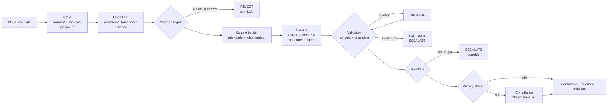

# Agente de Aprovação de Solicitações de Compra (LLM Engineering)

Case técnico Itaú, *Engenharia de Prompt, Contexto e Agentes*. Cenário 03: **aprovação de solicitações de compra**.

Um serviço Java/Spring Boot que recebe solicitações de compra (inclusive incompletas, ruidosas ou maliciosas), enriquece com contexto (orçamento, fornecedor, histórico, políticas) e usa o **Claude** de forma controlada para produzir uma **decisão estruturada, explicável e auditável**: `APPROVE`, `REJECT`, `ESCALATE_TO_HUMAN` ou `NEEDS_INFO`, com cada justificativa ancorada em evidências e um payload pronto para o ERP.

> **Princípio central:** o LLM é um componente de julgamento dentro de um sistema determinístico, e não o dono da decisão. As regras rígidas rodam antes dele, um validador em código confere tudo o que ele diz, e qualquer falha termina em revisão humana (*fail-safe*).

## Sumário

| Documento | Conteúdo |
|---|---|
| [SPEC.md](SPEC.md) | Especificação aprovada (requisitos → solução) e desvios registrados |
| [AGENT.md](AGENT.md) | Documento formal do agente: papéis, contratos, exemplos, limitações, fallbacks |
| [docs/architecture.md](docs/architecture.md) | Diagramas (componentes, sequência, decisão) e fluxo |
| [docs/context-and-tokens.md](docs/context-and-tokens.md) | Engenharia de contexto, token budget e FinOps |
| [docs/observability.md](docs/observability.md) | Métricas, logs, traces e alertas |
| [docs/testing-strategy.md](docs/testing-strategy.md) | Estratégia de testes e evals (golden set, regressão) |
| [docs/adr/](docs/adr/) | Decisões técnicas e trade-offs (ADRs) |
| [docs/limitations-and-evolution.md](docs/limitations-and-evolution.md) | Simplificações, limitações e evoluções |
| [docs/AI-USAGE.md](docs/AI-USAGE.md) | **Como e quando a IA foi usada na construção** |
| [docs/presentation.md](docs/presentation.md) | Roteiro da apresentação (30 min) |
| [CHANGELOG-SKILLS.md](CHANGELOG-SKILLS.md) | Criação, atualização e remoção de skills (prompts/políticas) |

## Como executar

**Pré-requisitos:** JDK 21. O Maven vem embutido (`./mvnw`). Não é preciso chave de API: por padrão roda com um LLM simulado determinístico.

```bash
./mvnw test                         # testes unitários + integração (sem chave, LLM fake)
./mvnw verify -Peval-fake           # golden set (34 casos) contra o LLM fake: pipeline, guardrails e fallbacks
./mvnw spring-boot:run              # sobe a API em http://localhost:8080 (LLM fake)
./scripts/demo.sh                   # 7 cenários + multi-turno + idempotência + métricas
./scripts/demo-skills.sh            # CRUD versionado de skills com rastreabilidade
```

**Com o Claude real** (requer uma chave do [Console Anthropic](https://console.anthropic.com/settings/keys)):

```bash
export ANTHROPIC_API_KEY=sk-ant-...
LLM_PROVIDER=anthropic ./mvnw spring-boot:run      # API usando claude-sonnet-5-5 + claude-haiku-4-5
./mvnw verify -Peval                               # golden set contra o modelo real (custo estimado < US$ 0,50)
```

No Windows (PowerShell): `.\mvnw.cmd ...` e `$env:ANTHROPIC_API_KEY="..."`.

| Variável | Default | Uso |
|---|---|---|
| `LLM_PROVIDER` | `fake` | `fake` ou `anthropic` |
| `ANTHROPIC_API_KEY` | — | Obrigatória com `anthropic` |
| `AGENT_API_KEY` | `dev-key-change-me` | Header `X-API-Key` exigido em `/v1/**` |
| `AGENT_FIXED_DATE` | `2026-10-06` | "Hoje" das regras de negócio (os dados sintéticos são de 2026) |
| `SPRING_PROFILES_ACTIVE` | — | `postgres` (persistência em PostgreSQL), `local` (logs em texto) |

## API

| Método | Rota | Descrição |
|---|---|---|
| `POST` | `/v1/purchase-requests/evaluate` | Avalia uma solicitação → `PurchaseDecision` (idempotente por conteúdo) |
| `POST` | `/v1/cases/{caseId}/messages` | Nova rodada de um caso `NEEDS_INFO` (`message` + `updates`) |
| `GET` | `/v1/cases/{caseId}` | Estado do caso (rodada, resumo incremental) |
| `GET` | `/v1/decisions/{decisionId}` | Auditoria: decisão, contexto incluído/excluído, versões, custo |
| `GET` | `/v1/decisions?requestId=` | Histórico de decisões de uma solicitação |
| `GET/POST/DELETE` | `/v1/skills[/{id}[/versions[/{v}/activate]]]` | CRUD versionado de skills |
| `GET` | `/actuator/prometheus` | Métricas (latência, tokens, custo, erros, fallbacks, guardrails) |

Contratos: [`purchase-request.v1.json`](src/main/resources/schemas/purchase-request.v1.json) → [`purchase-decision.v1.json`](src/main/resources/schemas/purchase-decision.v1.json). Exemplos de entrada estão em [`examples/`](examples/) e as respostas reais em [`examples/responses/`](examples/responses/).

## Arquitetura em uma imagem



## Resultados

| Verificação | Resultado |
|---|---|
| `./mvnw test` | 36 testes ✅ (unitários: intake, regras, contexto, validador, resiliência; integração: API, casos, skills, métricas) |
| `./mvnw verify -Peval-fake` | 38 turnos / 34 casos: acurácia 100%, schema 100%, grounding 100%, 0 decisões proibidas, adversariais 100% ([relatório](evals/reports/latest-fake.md)) |
| `./mvnw verify -Peval` (Claude real) | **Não executado até a entrega**: não havia chave de API disponível. O runner está pronto; ver [testing-strategy](docs/testing-strategy.md) |

> O eval com o LLM fake prova que **o sistema em volta do modelo** funciona: contratos, grounding, guardrails, fallbacks, multi-turno e custos. Ele **não** mede a qualidade de julgamento do Claude. Essa medida vem do `-Peval`, e o primeiro passo depois de obter a chave é rodá-lo e salvar o baseline (`-Deval.updateBaseline=true`).

## Stack

Java 21 · Spring Boot 3.5 · SDK oficial `anthropic-java` 2.68 · JSON Schema 2020-12 (networknt) · Resilience4j · Micrometer/Prometheus · JPA (H2 / PostgreSQL) · JUnit 5.

## Estrutura

```
src/main/java/com/itau/purchaseagent/
  contract/   DTOs e validação de JSON Schema         intake/   normalização, CNPJ, detector de injeção
  policy/     motor de regras determinístico          context/  ERP gateway, fatos, context builder, token budget
  llm/        cliente Anthropic, fake, resiliência     agent/    orquestrador, prompts, validador, montagem
  registry/   skills versionadas (CRUD)                audit/    registro de decisões e casos
  api/        controllers, filtro de borda, erros     observability/ métricas do agente
src/main/resources/
  schemas/    contratos v1                            skills/   prompts, políticas, exemplos (versionados)
  mock-data/  ERP sintético
evals/        golden set, relatórios, baseline        docs/     arquitetura, ADRs, uso de IA, apresentação
```
